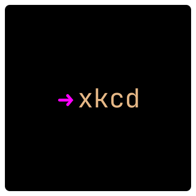
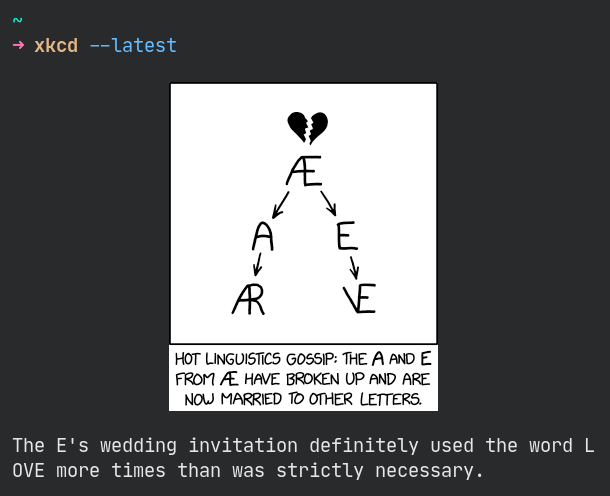

<h1 align="center">
    
  <br>
	xkcd
</h1>
<p align="center"><strong>Read xkcd from the comfort of your terminal</strong></p>
<br>

[xkcd](https://xkcd.com/) is probably the most popular webcomic with devs. It only seems right that you can read it from the comfort of your terminal via a `xkcd` command.

 <p align="center"></p>

 This is **the version that scrapes the webpage (*main* branch)**.

 To see the alternative version that uses the web api, go to the *json* branch.

## Requirements

Here is a summary of the dependencies:
- [Kitty](https://sw.kovidgoyal.net/kitty/) terminal. Kitty shows images via the `icat` kitten which is included in the default installation.
- [ImageMagick](https://www.imagemagick.org/) is used by Kitty under hood as far as I know.
- The utilties you find in most unix-like systems: [`curl`](https://curl.se/docs/manpage.html), [`grep`](https://en.wikipedia.org/wiki/Grep), [`cut`](https://en.wikipedia.org/wiki/Cut_(Unix)), and `perl`.

If you do not want to use Kitty, I believe [iTerm2](https://iterm2.com/index.html) has similar functionality with its [`imgcat` script](https://iterm2.com/documentation-images.html). It is a minor change to adapt the script to use that instead.

## Install

It is a shell script. You can run it as `./xkcd` when the file is in the current working directory.

It is preferable to move it to an executable location and be able to run it using `xkcd` anywhere e.g. move the *xkcd* file to */usr/local/bin* on linux.

## Usage

```
Usage: xkcd [-l|--latest] [-r|--random] [-h|--help]
  -h, --help          	Print the help page.
  -l, --latest        	Show the latest comic.                                   
  -r, --random        	Show a random comic.                                  
```

For example, to show a random comic, run the command `xkcd --random`.

## Want to learn about the code?

I wrote an article where I walked through a minimal version of the code - [Read XKCD in the terminal with some bash magic](https://www.roboleary.net/2022/02/24/xkcd-in-the-terminal-with-some-bash-magic.html).

## Appreciate

You can show your appreciation by:
1. [Buying me a coffee or sponsoring me](https://ko-fi.com/roboleary)
1. Starring the repo 🌟.

This will **help other people find the extension**.

It will **offer me encouragement** to continue, and can provide **a path to dedicating more time to open-source** in the future.

Thank you! 🙏

## Attribution

XKCD is licensed under a [Creative Commons Attribution-NonCommercial 2.5 License](https://creativecommons.org/licenses/by-nc/2.5/).
